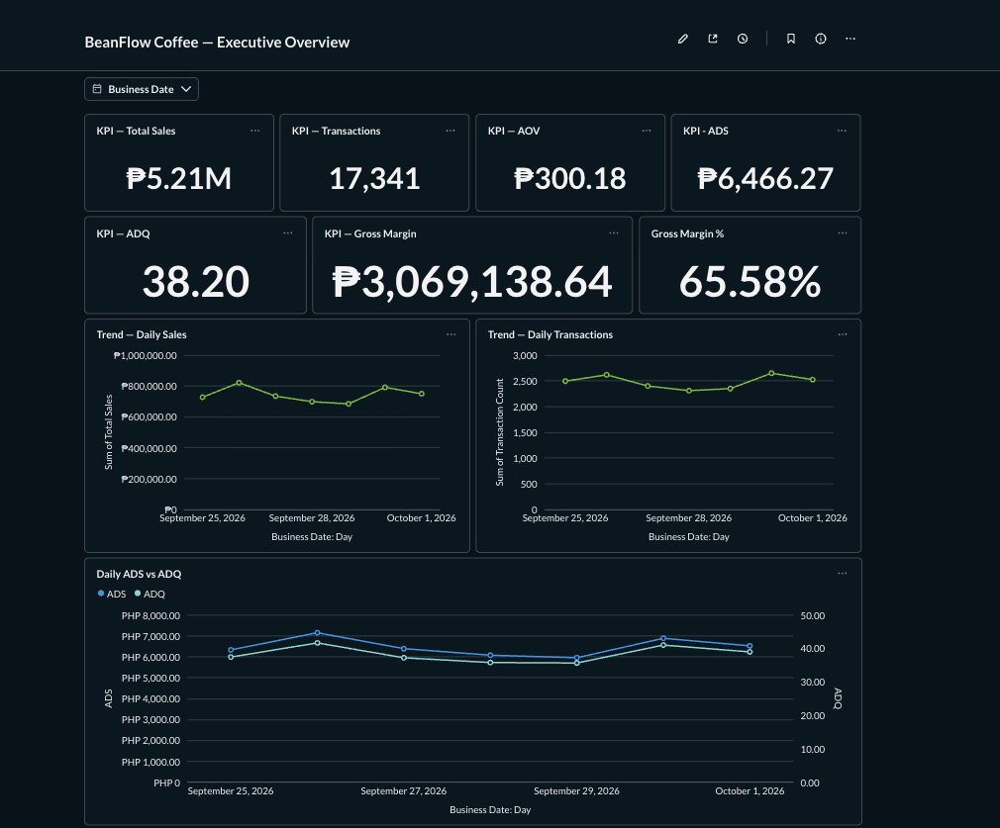
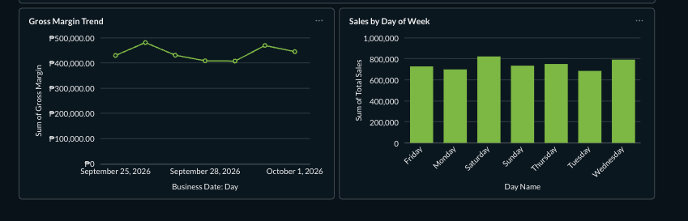
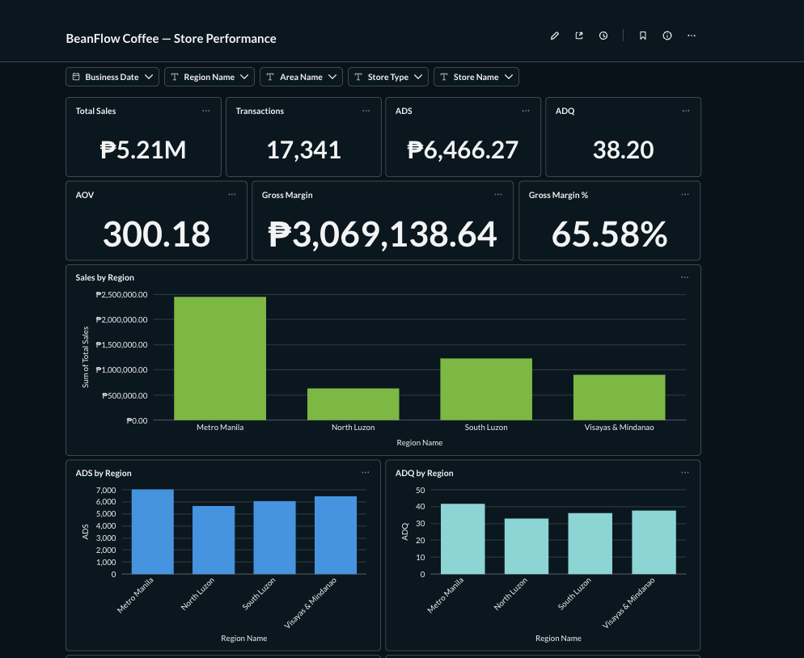
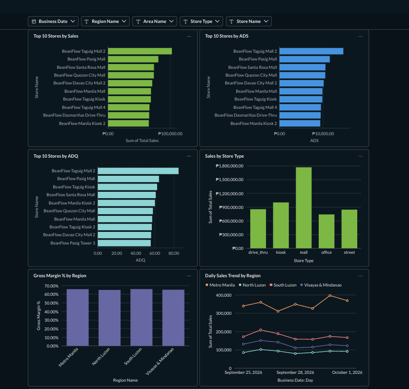
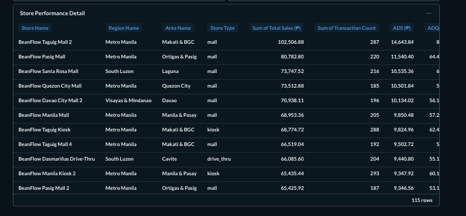
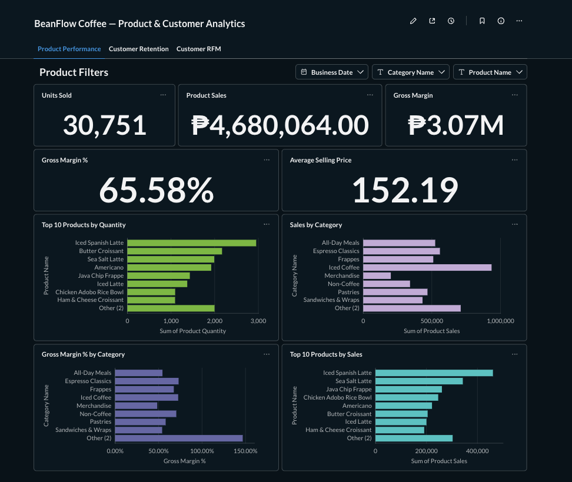
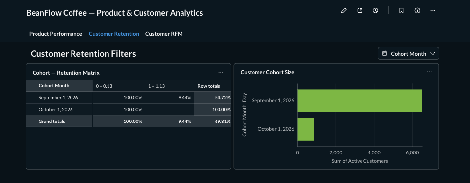
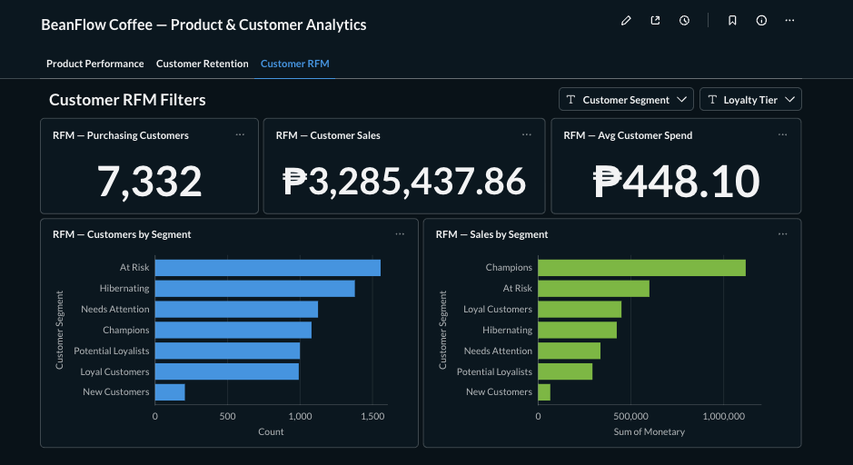

# BeanFlow Coffee — Retail Analytics Platform

An end-to-end retail analytics portfolio project that simulates a multi-store coffee business and demonstrates practical **Data Engineering** and **Data Analytics** workflows.

BeanFlow Coffee covers the complete path from operational data generation to business intelligence:

```text
PostgreSQL
    ↓
Python EL
    ↓
Parquet Landing
    ↓
BigQuery Bronze
    ↓
dbt Silver
    ↓
dbt Intermediate
    ↓
dbt Gold
    ↓
Analytics Marts
    ↓
Metabase
```

All data in this project is fully synthetic.

---

## Project Goals

This project was built to demonstrate how a retail analytics platform can:

- ingest operational POS data incrementally
- preserve source history
- handle overlapping extraction windows safely
- reconstruct SCD Type 2 history
- build dimensional facts and dimensions
- create reusable analytics marts
- define and govern business KPIs
- support store, product, customer, and executive reporting
- validate metrics through dbt tests and reconciliations
- expose curated models to a BI layer

The project is designed to reflect both **Data Analyst** and **Data Engineer** responsibilities.

---

# Architecture

## End-to-End Flow

```text
Synthetic Retail Data
        ↓
PostgreSQL POS
        ↓
Python Incremental EL
        ↓
Parquet Landing
        ↓
BigQuery Bronze
        ↓
dbt Silver
        ↓
dbt Intermediate
        ↓
dbt Gold
        ↓
Analytics Marts
        ↓
Metabase Dashboards
```

The detailed architecture is documented in:

- [`docs/architecture.md`](docs/architecture.md)

---

# Technology Stack

| Layer | Technology |
|---|---|
| Operational source | PostgreSQL 16 |
| Synthetic data generation | Python |
| Extraction / loading | Python |
| Landing layer | Parquet |
| Cloud warehouse | Google BigQuery |
| Transformation | dbt Core |
| Modeling | Dimensional / Star Schema |
| BI | Metabase |
| Containerization | Docker / Docker Compose |
| Version control | Git / GitHub |
| Cloud IAM | Google Cloud IAM |

---

# Source System

The simulated PostgreSQL POS source contains:

- `regions`
- `areas`
- `stores`
- `product_categories`
- `products`
- `customers`
- `promotions`
- `orders`
- `order_items`
- `payments`

The simulator represents a coffee retail business with approximately:

```text
120 stores
4 regions
12 areas
```

The source contains mutable entities so the downstream pipeline can demonstrate:

- incremental extraction
- late updates
- replay-safe ingestion
- historical reconstruction

---

# Ingestion Design

The Python EL pipeline supports both:

```text
full extraction
incremental extraction
```

Mutable tables use `updated_at` as their source change timestamp.

Incremental windows intentionally overlap previous runs so recently updated records are not missed.

This can create replay copies in Bronze, so the Silver layer deduplicates by logical source version:

```text
primary key + updated_at
```

This preserves real historical versions while removing duplicate ingestion copies.

---

# Parquet Landing

Extracted data is written to local Parquet before loading to BigQuery.

Example:

```text
data/
└── landing/
    ├── orders/
    │   └── dt=2026-10-01/
    │       └── part-000.parquet
    ├── order_items/
    ├── customers/
    └── ...
```

The landing layer provides a durable local extraction history and separates extraction from warehouse loading.

---

# BigQuery Bronze

Raw data is loaded into:

```text
raw_pos
```

Bronze preserves:

- source columns
- source versions
- overlapping extraction results
- ingestion metadata

Business-level deduplication is intentionally deferred to dbt.

The project can run on **BigQuery Sandbox**, with local Parquet acting as the durable historical landing layer.

---

# dbt Transformation Layers

The dbt project separates transformation responsibilities into:

```text
Silver
→ Intermediate
→ Gold
→ Analytics Marts
```

## Silver

Silver models standardize source data and remove replay duplicates while preserving valid source history.

## Intermediate

Reusable models include:

```text
int_product_versions
int_store_versions
int_store_calendar
int_store_daily_orders
int_store_daily_items
```

These models handle:

- SCD history construction
- reusable daily aggregation
- store-day calendar spines

## Gold

Gold contains analytics-ready dimensions and facts.

### Dimensions

```text
dim_store
dim_product
dim_customer
dim_promotion
dim_date
dim_time
```

### Facts

```text
fct_orders
fct_order_items
fct_payments
fct_store_daily_sales
```

---

# Historical Modeling

## Product SCD Type 2

`dim_product` preserves product history.

Historical validity is reconstructed using:

```text
valid_from = updated_at
valid_to   = next updated_at
```

Facts use point-in-time joins:

```text
valid_from <= event_timestamp
AND event_timestamp < valid_to
```

This allows historical product cost and gross margin to remain correct even after product updates.

## Store SCD Type 2

`dim_store` uses the same historical approach for store attributes.

## Customer SCD Type 1

`dim_customer` stores the latest known customer state.

---

# Authoritative KPI Fact

The model:

```text
fct_store_daily_sales
```

has grain:

```text
store × business date
```

It is the authoritative store-level KPI fact.

A store-day calendar spine ensures eligible open stores remain represented even if they record zero completed sales.

This is important for reliable ADS and ADQ calculations.

---

# Core KPI Definitions

## Realized Sales

```text
order_status = 'completed'
```

Cancelled and refunded orders are excluded.

## AOV

```text
AOV = Total Sales / Transactions
```

## ADS

```text
ADS = Total Sales / Open Store-Days
```

At aggregated level:

```text
SUM(total_sales)
/
COUNT(DISTINCT store_day_key)
```

## ADQ

```text
ADQ = Product Quantity / Open Store-Days
```

At aggregated level:

```text
SUM(product_quantity)
/
COUNT(DISTINCT store_day_key)
```

## Gross Margin

```text
Gross Margin = Item Sales - Product Cost
```

## Gross Margin %

```text
Gross Margin % = Gross Margin / Item Sales
```

Ratio KPIs are always recalculated from their numerator and denominator instead of averaging pre-calculated lower-grain ratios.

Full KPI documentation:

- [`docs/kpi_definitions.md`](docs/kpi_definitions.md)

---

# Analytics Marts

The business-facing marts are:

```text
executive_daily
store_performance
product_performance
customer_cohorts
customer_rfm
```

## `executive_daily`

Grain:

```text
business date
```

Used for executive KPIs and trends.

## `store_performance`

Grain:

```text
store × business date
```

Used for:

- region analysis
- area analysis
- store rankings
- store-type analysis
- ADS
- ADQ
- AOV
- gross margin

## `product_performance`

Grain:

```text
historical product version × business date
```

Used for:

- product sales
- product quantity
- category analysis
- historical gross margin

## `customer_cohorts`

Used for customer retention analysis based on first completed purchase month.

Retention is modeled as:

```text
non-cumulative monthly retention
```

## `customer_rfm`

Grain:

```text
one row per purchasing customer
```

Supports:

```text
Recency
Frequency
Monetary
Customer Segment
```

---

# Metabase Dashboards

## Executive Overview





The Executive Overview includes:

- Total Sales
- Transactions
- AOV
- ADS
- ADQ
- Gross Margin
- Gross Margin %
- Daily sales trend
- Regional performance

---

## Store Performance







The Store Performance dashboard supports filters for:

- Business Date
- Region
- Area
- Store Type
- Store

It includes:

- sales by region
- ADS by region
- ADQ by region
- top stores
- store-type performance
- gross margin analysis
- detailed store performance

---

## Product & Customer Analytics







This dashboard contains separate analytical sections for:

### Product Performance

- Product Sales
- Units Sold
- Gross Margin
- Gross Margin %
- Average Selling Price
- Category performance
- Product rankings

### Customer Retention

- Cohort Size
- Active Customers
- Month Number
- Retention Rate

### Customer RFM

- Purchasing Customers
- Customer Sales
- Average Customer Spend
- Customers by RFM Segment
- Sales by RFM Segment

---

# Validated Business Results

The current synthetic analytical period covers seven business days:

```text
2026-09-25 to 2026-10-01
```

## Company Performance

```text
Total Sales        5,205,346.11
Transactions          17,341
Product Quantity      30,751
Store-Days               805
AOV                    300.18
ADS                  6,466.27
ADQ                     38.20
Gross Margin      3,069,138.64
Gross Margin %          65.58%
```

## Regional Performance

| Region | Sales | Store-Days | ADS | ADQ |
|---|---:|---:|---:|---:|
| Metro Manila | 2,448,210.11 | 350 | 6,994.89 | 41.47 |
| North Luzon | 631,182.38 | 112 | 5,635.56 | 32.80 |
| South Luzon | 1,225,068.41 | 203 | 6,034.82 | 36.00 |
| Visayas & Mindanao | 900,885.21 | 140 | 6,434.89 | 37.53 |

## Customer Cohorts

```text
Sep 2026 Month 0: 6,494 customers
Sep 2026 Month 1:   613 active customers
Month 1 Retention:  9.44%

Oct 2026 Month 0:   838 customers
```

## Customer RFM

```text
Purchasing Customers: 7,332
Customer Sales:       3,285,437.86
```

The **Champions** segment produced the highest total sales and the highest average customer monetary value in the current short analysis window.

More detailed business findings:

- [`docs/insights.md`](docs/insights.md)

---

# Data Quality

The final dbt project successfully completed:

```text
15 table models
15 view models
239 data tests
```

Final validation:

```text
PASS=269
WARN=0
ERROR=0
SKIP=0
TOTAL=269
```

Validation covers:

- replay deduplication
- primary-key uniqueness
- source-version uniqueness
- not-null checks
- relationship checks
- accepted values
- SCD interval validation
- store-day construction
- order-sales reconciliation
- product-quantity reconciliation
- cohort calculations
- RFM grain validation

---

# Data Dictionary

The project contains documentation for all **30 dbt models**.

The data dictionary is generated from:

```text
manifest.json
catalog.json
```

and includes:

- model name
- model type
- model grain
- warehouse column type
- dbt column descriptions

See:

- [`docs/data_dictionary.md`](docs/data_dictionary.md)

---

# Repository Structure

```text
retail-analytics-platform/
│
├── bi/
│   └── metabase/
│       ├── docker-compose.yml
│       └── .env.example
│
├── data/
│   └── landing/
│
├── dbt/
│   └── beanflow/
│       ├── models/
│       │   ├── staging/
│       │   ├── intermediate/
│       │   └── marts/
│       └── ...
│
├── docs/
│   ├── architecture.md
│   ├── data_dictionary.md
│   ├── insights.md
│   ├── kpi_definitions.md
│   ├── setup_gcp.md
│   └── images/
│
├── ingestion/
│
├── simulator/
│
├── source_db/
│
├── scripts/
│
├── docker-compose.yml
├── Makefile
└── README.md
```

---

# Local Setup

## 1. Clone the repository

```bash
git clone <repository-url>
cd retail-analytics-platform
```

## 2. Create local environment configuration

Copy the provided environment template:

```bash
cp .env.example .env
```

Update local values as required.

Never commit `.env`, service-account keys, or credentials.

---

# PostgreSQL Source

Start the source database:

```bash
docker compose up -d
```

The local PostgreSQL source uses:

```text
127.0.0.1:5433
```

---

# BigQuery Setup

Google Cloud setup instructions are documented in:

- [`docs/setup_gcp.md`](docs/setup_gcp.md)

The project uses:

```text
BigQuery Bronze: raw_pos
dbt development datasets:
dbt_dev_silver
dbt_dev_intermediate
dbt_dev_gold
```

---

# dbt Setup

From:

```text
dbt/beanflow
```

configure your local dbt profile and authenticate to Google Cloud.

Useful commands:

```bash
dbt debug
dbt run
dbt test
dbt build
dbt docs generate
```

Generated dbt artifacts are intentionally ignored by Git.

---

# Metabase Setup

The Metabase local environment is stored under:

```text
bi/metabase/
```

Create the local config:

```bash
cd bi/metabase
cp .env.example .env
```

Then update:

```text
METABASE_DB_PASSWORD
```

Start Metabase:

```bash
docker compose up -d
```

Open:

```text
http://localhost:3000
```

The portfolio setup connects Metabase to BigQuery using a dedicated read-only Google Cloud service account.

Service-account JSON files must never be committed.

---

# Documentation

| Document | Purpose |
|---|---|
| [`docs/architecture.md`](docs/architecture.md) | End-to-end architecture and modeling decisions |
| [`docs/kpi_definitions.md`](docs/kpi_definitions.md) | Business KPI definitions and aggregation rules |
| [`docs/data_dictionary.md`](docs/data_dictionary.md) | dbt model and column documentation |
| [`docs/insights.md`](docs/insights.md) | Business findings from the synthetic dataset |
| [`docs/setup_gcp.md`](docs/setup_gcp.md) | Google Cloud / BigQuery setup |

---

# Key Engineering Decisions

This project intentionally demonstrates several production-oriented design choices:

- overlapping incremental extraction windows
- replay-safe Silver deduplication
- historical source-version preservation
- SCD Type 2 reconstruction without relying on dbt snapshots
- point-in-time joins
- denominator-complete store-day modeling
- separation of order and payment lifecycle logic
- additive component storage for non-additive KPIs
- dedicated analytics marts for BI
- read-only BI warehouse access
- secrets excluded from version control

---

# Key Analytical Lessons

The project demonstrates why:

- absolute sales alone are insufficient for fair store comparison
- ADS and ADQ require a reliable Store-Day denominator
- ratio KPIs should not be averaged across lower-grain rows
- product margin requires historical cost
- customer-attributed sales do not necessarily equal company sales
- customer retention requires appropriate observation windows
- customer count and customer value are different analytical questions

---

# Current Limitations

This is a portfolio project with a deliberately short synthetic analytical history.

Current limitations include:

- seven-day reporting window
- limited mature cohort history
- RFM segments based on a short observation period
- no production scheduler deployment
- no long-term cloud storage layer beyond the local Parquet landing setup

These limitations are documented intentionally rather than hidden.

---

# Possible Future Enhancements

Future extensions could include:

- Apache Airflow orchestration
- longer synthetic history
- month-over-month reporting
- year-over-year reporting
- customer lifetime value
- mature retention curves
- promotion effectiveness
- basket analysis
- daypart analysis
- store-opening ramp analysis
- automated CI for dbt
- warehouse cost monitoring
- cloud object storage landing
- production-grade secrets management

---

# Portfolio Focus

BeanFlow Coffee demonstrates skills across:

## Data Engineering

- PostgreSQL
- Python EL
- incremental ingestion
- Parquet
- BigQuery
- dbt
- SCD Type 2
- dimensional modeling
- data quality testing
- Docker

## Data Analytics

- KPI governance
- sales analysis
- store performance
- product performance
- customer cohorts
- RFM segmentation
- business interpretation
- Metabase dashboarding

---

## Disclaimer

BeanFlow Coffee is a fictional brand created for this portfolio project.

All datasets, customers, stores, orders, and business results shown in this repository are synthetic.
